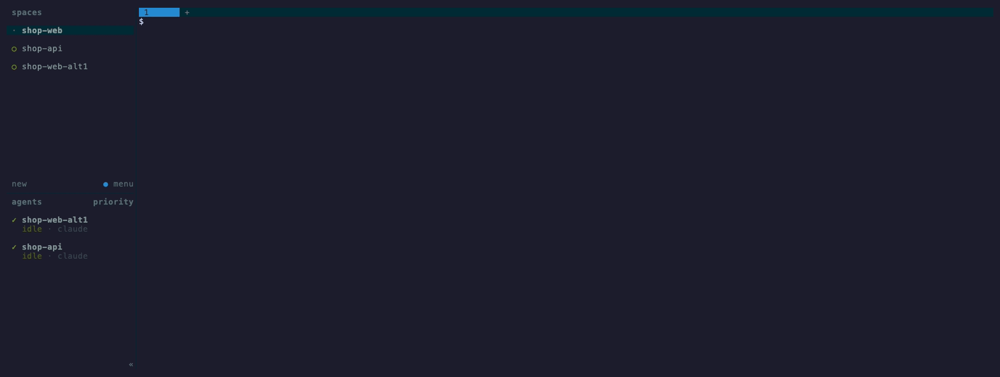

# lazy-claude-herdr

[English](README.md) · **日本語** · [中文](README.zh.md)

[herdr](https://herdr.dev) のどの space からでも Claude Code の会話を探して、**その会話が始まった場所**で再開するツールです。

herdr で複数の space（git worktree ごと、など）に分けて Claude Code を動かしていると、`claude --resume` は今いるディレクトリの会話しか出しません。翌日には「あのタスクはどの space だったか」を忘れています。lazy-claude-herdr は全 space の会話を 1 つの一覧に出し、Enter で元の場所へ戻します。

- **実行中の会話** → それが動いている pane へフォーカス（別の space でも）
- **停止中の会話** → ディレクトリが一致する space の pane を分割して `claude -r`（該当 space が無ければ作成）



## 機能

- herdr のどこからでもキー 1 つで overlay ポップアップとして開く
- 各行に 実行中マーク・環境・最終活動・タイトル・PR・ブランチ。列揃え済み、環境ごとに色分け
- 文字入力であいまい絞り込み、**数字入力でその番号の行へジャンプ**
- `ctrl-s` で並び順を切替（最近順 / 環境別 / 実行中優先）、`ctrl-a` / `ctrl-d` で全期間 / 直近 N 日
- プレビュー: 状態・パス・ブランチ・PR・最後の指示
- `ctrl-o` でその行の操作メニュー: fork して新しい pane で再開、PR を開く、レビュー依頼メッセージをコピー、PR の状態と CI、会話ログ、shell pane を開く、再開コマンド / ブランチ / ID のコピー、さらに設定で追加した自分の操作
- 直接キー: `ctrl-r` PR を開く · `ctrl-y` レビュー依頼をコピー · `ctrl-t` fork
- UI は英語・日本語・中国語
- herdr の外でも普通の CLI として動く


## 必要なもの

- herdr 0.7 以上と Claude integration（`herdr integration install claude`）。無くても実行中マーク以外は動きます
- [fzf](https://github.com/junegunn/fzf)
- Python 3.11 以上（標準ライブラリのみ）
- 任意: [`gh`](https://cli.github.com/)（PR の状態、レビュー依頼のタイトル取得に使用）
- macOS または Linux

## インストール

```sh
herdr plugin install kakigakki/lazy-claude-herdr
```

`~/.config/herdr/config.toml` にキーを割り当てて `herdr server reload-config`:

```toml
[[keys.command]]
key = "prefix+f"
type = "plugin_action"
command = "lazy-claude-herdr.open"
```

コマンドとしても使う場合は、エントリポイントを PATH に link します:

```sh
root=$(herdr plugin list --json | python3 -c 'import json,sys; print(next(p["plugin_root"] for p in json.load(sys.stdin)["result"]["plugins"] if p["plugin_id"] == "lazy-claude-herdr"))')
ln -s "$root/bin/lazy-claude-herdr" ~/.local/bin/
```

## 使い方

| 一覧で | |
|---|---|
| 文字を入力 | あいまい絞り込み（タイトル・環境・ブランチ・`#PR`） |
| 数字を入力 | その番号の行へジャンプ（数字では絞り込まない。PR 番号は `#123` で検索） |
| `Enter` | 再開 |
| `ctrl-o` | 操作メニュー（文字キーか番号で即実行） |
| `ctrl-s` | 並び順を切替 |
| `ctrl-a` / `ctrl-d` | 全期間 / 直近 N 日 |
| `ctrl-r` / `ctrl-y` / `ctrl-t` | PR を開く / レビュー依頼をコピー / fork |
| `esc` | 閉じる |

コマンドライン:

```sh
lazy-claude-herdr [キーワード]      # 絞り込み済みで一覧を開く
lazy-claude-herdr -a                # 全期間
lazy-claude-herdr -l [キーワード]   # 一覧を出力するだけ
lazy-claude-herdr -s env            # 並び順: recent | env | live
lazy-claude-herdr --do resume <id>  # 一覧を開かずに操作を 1 つ実行
```

## 設定

`~/.config/lazy-claude-herdr/config.toml`（`$XDG_CONFIG_HOME/...` や `$LAZY_CLAUDE_HERDR_CONFIG` も可）。すべて省略可能です。例は [examples/config.toml](examples/config.toml)。

```toml
language = "ja"                 # en | ja | zh

[defaults]
days = 14                       # 0 = 全期間
sort = "recent"                 # recent | env | live

[review_request]
template = "{title}\nのレビューお願いします🙏\n{url}"   # {title} {url} {number}

[[envs]]                        # ディレクトリの表示名。宣言順 =「環境別」の並び順
match = "~/code/shop-*"         # パスか glob。サブディレクトリにもマッチ
label = "shop-wt"
color = "cyan"                  # または "ansi:38;5;208"

[[actions]]                     # メニューに自分の操作を追加
key = "g"
label = "ここで lazygit を開く"
run = "lazygit"                 # {id} {cwd} {branch} {pr} {pr_url} {pr_repo} {title}
mode = "pane"                   # background（既定）| pane | pager
requires = []                   # どれかが空なら表示しない
when = "test -d .git"           # 終了コード 0 のときだけ表示（会話のディレクトリで実行）
direct = "ctrl-g"               # 一覧での直接キー（任意）
close = false                   # true: background の操作でも実行後に一覧を閉じる
```

変数は展開時に shell quote され、`LCH_ID`、`LCH_CWD`、`LCH_BRANCH` … として環境変数にも入ります。コマンドは会話のディレクトリで `/bin/sh` により実行されます（`pane` モードは新しい pane の中であなたの shell が実行します）。

## 仕組み

- 会話は Claude Code が `~/.claude/projects` に残すトランスクリプトから読みます（`$CLAUDE_CONFIG_DIR` に対応）。ファイルサイズと mtime をキーにした小さなキャッシュ付き。非対話（`claude -p`）の会話と、ディレクトリが消えた会話は出しません。
- herdr は CLI 経由で操作します。どの pane でどの会話が動いているかは Claude integration の `agent_session` で判定し、space は worktree のパス → pane のディレクトリ → ラベルの順で探します。
- herdr は overlay を閉じると元のフォーカスに戻すため、ポップアップ内でのフォーカス移動は、overlay が閉じるのを待つ別プロセスに任せています。

## 注意

- **Claude Code のトランスクリプト形式は公開 API ではありません。** タイトルや PR リンクなどのフィールドは、Claude Code のリリースで変わる可能性があります。フィールドが欠けても落ちずに縮退しますが（PR 列が空になる等）、ときどき壊れる前提で使ってください。
- herdr 0.7 の API（プラグインの overlay pane、`agent_session`）に依存しています。herdr 0.7.3 で動作確認しています。
- Claude Code は `cleanupPeriodDays`（既定 30 日）を過ぎた会話を削除するので、「全期間」はおおよそその範囲です。

## 開発

```sh
python3 -m unittest discover -s tests   # 標準ライブラリのみ。herdr・gh・clipboard は PATH 上の fake
vhs demo/demo.tape                      # demo/demo.gif を再生成（フィクスチャデータ）
vhs demo/herdr.tape                     # demo/herdr.gif を再生成（隔離した herdr セッション）
herdr session stop lch-demo && herdr session delete lch-demo
```

## ライセンス

MIT
